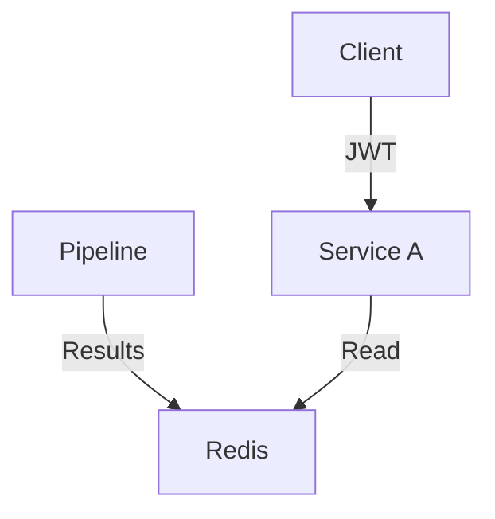

# MLOps Template Repo

One line explanation of repo purpose, e.g.

MLOps Template Repo. Implements templates of various services. 

| Item | Cloud Console Link | Logs Link | Service Link | Alerts?
|----|----|----|----|----|
Batch Inference | Link | Link | Link (raw) | Link
API Gateway | Link | Link | Link (raw) | Link

## Services

[Batch Inference](./src/batch/README.md)

## Architecture Diagram

MermaidJS Diagram (simple flowchart) showing architecture of how individual services are related.

## Description

Detailed description (with any diagrams, mathjax etc) to explain what this repo is doing.