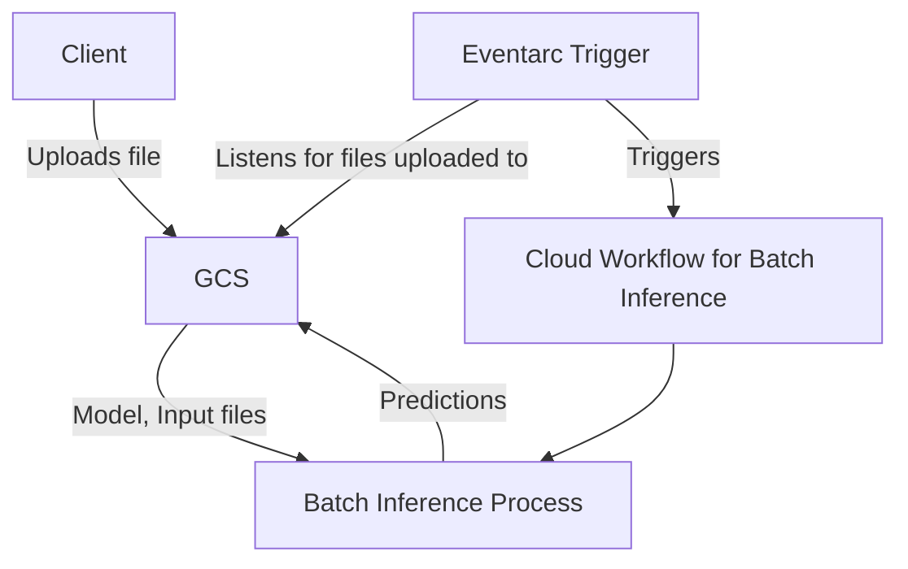
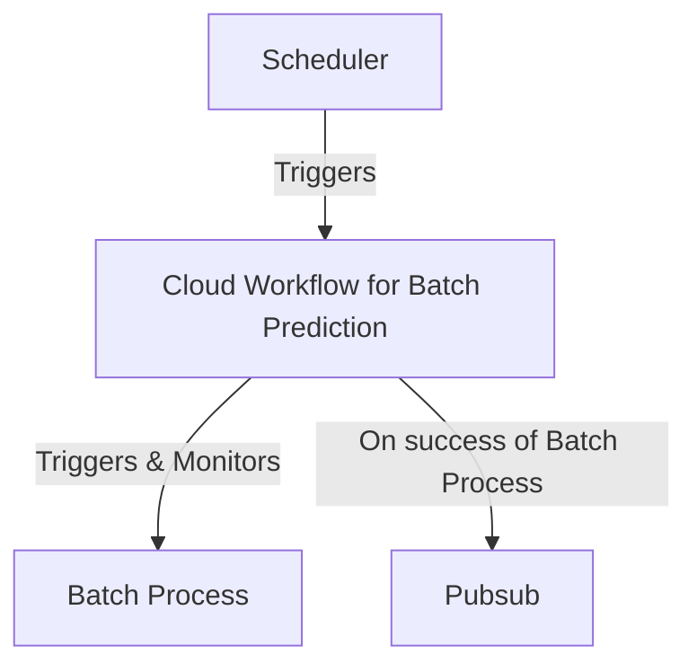

# Template Batch App

Add one line description here, e.g. Batch inference template app to convert texts to upper-case.

## Usage

```
Add usage details here
```

## Creating the necessary infrastructure

### For inference
To add a new client to the batch app, on staging the following is managed via terraform, on
dev the following gcloud commands must be run by someone with relevant permissions:
```bash
PROJECT=thg-ml-dev
PRODUCT=mlops-template
CLIENT=my-client
TARGET_WORKFLOW=$PRODUCT-batch-inference
WORKFLOW_LOCATION=europe-west2

# Creating the client's service account (if it doesn't already exist)
gcloud iam service-accounts create $CLIENT

gcloud projects iam add-iam-policy-binding $PROJECT $CLIENT@$PROJECT.iam.gserviceaccount.com \
--role=roles/storage.objectLister

gcloud projects iam add-iam-policy-binding $PROJECT $CLIENT@$PROJECT.iam.gserviceaccount.com \
--role=roles/storage.objectCreator \
--condition="condition=resource.name.startsWith('projects/_/buckets/$PROJECT-batch/objects/$PRODUCT/$CLIENT/inputs/')"

gcloud projects iam add-iam-policy-binding $PROJECT $CLIENT@$PROJECT.iam.gserviceaccount.com \
--role=roles/storage.objectViewer \
--condition="condition=resource.name.startsWith('projects/_/buckets/$PROJECT-batch/objects/$PRODUCT/$CLIENT/')"

# Creating the client's eventarc trigger
gcloud eventarc triggers create batch-$PRODUCT-$CLIENT --project=$PROJECT --location=global \
--destination-workflow=$TARGET_WORKFLOW --destination-workflow-location=$WORKFLOW_LOCATION \
--service-account=$PRODUCT@$PROJECT.iam.gserviceaccount.com \
--event-filters="type=google.cloud.audit.log.v1.written" --event-filters="serviceName=storage.googleapis.com" \
--event-filters="methodName=storage.objects.create" \
--event-filters-path-pattern="resourceName=/projects/_/buckets/$PROJECT-batch/objects/$PRODUCT/$CLIENT/inputs/*"

# Creating the client's output topic
gcloud pubsub topics create batch-$PRODUCT-$CLIENT-outputs
```

### For scheduling
For scheduled/training applications, an output topic is necessary just to put the message of whether the job succeeded 
or not, to drive further events in the future (e.g. Teams notification - TBD).

We also require the scheduler to be created via a gcloud command as this is treated as infrastructure.
```bash
PROJECT=thg-ml-dev
PRODUCT=mlops-template
CLIENT=my-client
TARGET_WORKFLOW=$PRODUCT-batch-scheduled
LOCATION=europe-west2

gcloud scheduler jobs create http "$TARGET_WORKFLOW" \
--schedule="4 5 * * *" \
--location="$LOCATION" \
--uri="https://workflowexecutions.googleapis.com/v1/projects/$PROJECT/locations/$LOCATION/workflows/$TARGET_WORKFLOW/executions" \
--oauth-service-account-email="$PRODUCT@$PROJECT.iam.gserviceaccount.com" \
--time-zone="Europe/London"

# Creating the scheduled batch job results output topic (only once)
gcloud pubsub topics create batch-$PRODUCT-$CLIENT-outputs
```

## Architecture Diagram

### Inference


### Scheduled



See [this excalidraw diagram](https://excalidraw.com/#room=323e3e16583ac3f12d2a,V8zUi4QJbSWsQOAJIXtMEQ) for a more detailed picture.

## Description

Detailed description of your app.

## Development

### Running locally

#### Building the image

To build the docker image locally, you can use either cloud build and then download the image locally, or you can build the image
directly on your laptop. You may want to use cloud build as the network speeds may be faster than your home network, especially in
the case where you plan to upload the image to GCP.

A docker build can be completed as follows:
```bash
PROJECT_NAME=thg-ml-dev
IMAGE_NAME=mlops-template-inference
TAG=my-image-tag
ML_PRODUCT=mlops-template
PYTHON_VERSION=3.9.12

cd src/batch/

docker build . -t $IMAGE_NAME:$TAG  -f ./Dockerfile --build-arg PROJECT_NAME=$PROJECT_NAME --build-arg ML_PRODUCT=$ML_PRODUCT --build-arg PYTHON_VERSION=$PYTHON_VERSION
```

A cloud build can be completed as follows:
```bash
PROJECT_NAME=thg-ml-dev
IMAGE_NAME=mlops-template-inference
TAG=my-image-tag
ML_PRODUCT=mlops-template
PYTHON_VERSION=3.9.12

cd src/batch
gcloud builds submit \
--project $PROJECT_NAME
--config cloudbuild.yaml \
--substitutions=COMMIT_SHA=$TAG,_ML_PRODUCT=$ML_PRODUCT,_PYTHON_VERSION=$PYTHON_VERSION,_IMAGE_NAME=$IMAGE_NAME
```


#### Deploying a batch task manually

Put the following into a `batch.json` file:

```json
{
    "taskGroups": [
        {
            "taskSpec": {
                "runnables": [
                    {
                        "container": {
                            "imageUri": "europe-docker.pkg.dev/thg-ml-dev/docker/mlops-template-batch",
                            "entrypoint": "python",
                            "commands": ["main.py", "product/client/input_file.jsonl", "product/client/output_file.jsonl"]
                        }
                    }
                ]
            },
            "taskCount": 1,
            "parallelism": 1
        }
    ],
    "allocationPolicy": {
        "instances": [
            {
                "policy": {
                    "machineType": "n1-standard-2",
                    "bootDisk": {
                        "sizeGb": "50",
                        "image": "batch-cos"}
                }
            }
        ],
        "location": {
            "allowedLocations": [
                "zones/europe-west1-b",
                "zones/europe-west1-d"
            ]
        },
      "serviceAccount": {
          "email": "mlops-template@thg-ml-dev.iam.gserviceaccount.com" }
    }
}
```

Create the batch job using the following command:

`gcloud batch jobs submit my-batch-job --location europe-west2 --config batch.json`

## Deployment

Add any development considerations here.

## Troubleshooting

If you're running out of memory within the Cloud Workflow it may be due to trying to use too much memory.
See [Cloud Workflows](https://cloud.google.com/workflows/quotas#resource_limits).

Add any troubleshooting tips here.